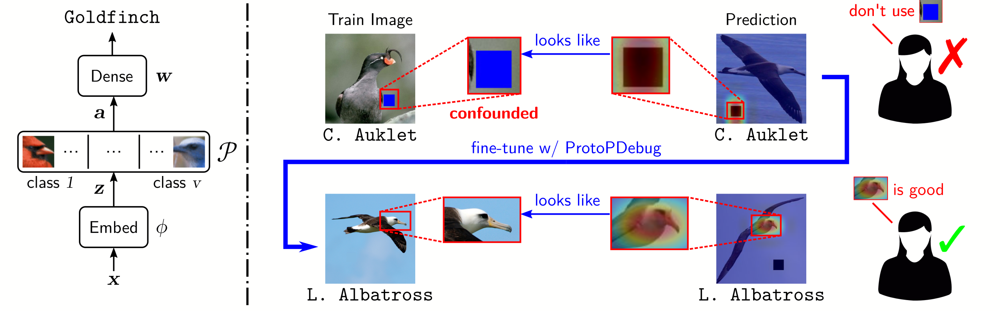

# Concept-level Debugging of Part-Prototype Networks



Implementation of the paper

Bontempelli, A., Teso, S., Giunchiglia, F., & Passerini, A. (2023). _Concept-level Debugging of Part-Prototype Networks_. [](https://arxiv.org/abs/2205.15769)

Accepted for publication at [ICLR 2023](https://openreview.net/forum?id=oiwXWPDTyNk) ([slides](slides/protopdebug___iclr23.pdf), [Poster](slides/poster_iclr23.pdf)).

The code in this repository is an adaptation of the code in the following repositories:

|                                        | Repository                                 | License                                                                                                         |
|----------------------------------------|--------------------------------------------|-----------------------------------------------------------------------------------------------------------------|
| ProtoPNet                              | https://github.com/cfchen-duke/ProtoPNet   | [See License](https://github.com/cfchen-duke/ProtoPNet/blob/81bf2b70cb60e4f36e25e8be386eb616b7459321/LICENSE)   |  
| IAIA-BL loss                           | https://github.com/alinajadebarnett/iaiabl | [See License](https://github.com/alinajadebarnett/iaiabl/blob/04efedb3f6bd0b4495e90b4d4bfcbeacfde0db57/LICENSE) |
| Covid data processing and data loaders | https://github.com/suinleelab/cxr_covid    | [See License](https://github.com/suinleelab/cxr_covid/blob/9a48838a39209583d968fa211dbe0e542eab8803/license.md) |

Used datasets:

- **CUB-200-2011**: Wah, C., Branson, S., Welinder, P., Perona, P., & Belongie, S. (2022). CUB-200-2011 (1.0) [Data set]. CaltechDATA. https://doi.org/10.22002/D1.20098
- **CUB-200-2011 Segmentations**:  Farrell, R. (2022). CUB-200-2011 Segmentations (1.0) [Data set]. CaltechDATA. https://doi.org/10.22002/D1.20097
- **ChestX-ray14**: Xiaosong Wang, Yifan Peng, Le Lu, Zhiyong Lu, MohammadhadiBagheri, Ronald M. Summers.ChestX-ray8: Hospital-scale Chest X-ray Database and Benchmarks on Weakly-Supervised Classification and Localization of Common Thorax Diseases, IEEE CVPR, pp. 3462-3471,2017
- **GitHub-COVID**: COVID-19 Image Data Collection: Prospective Predictions Are the Future
Joseph Paul Cohen and Paul Morrison and Lan Dao and Karsten Roth and Tim Q Duong and Marzyeh Ghassemi
arXiv:2006.11988, https://github.com/ieee8023/covid-chestxray-dataset, 2020
- **PadChest**: Aurelia Bustos, Antonio Pertusa, Jose-Maria Salinas, and Maria de la Iglesia-Vayá. Padchest:
A large chest x-ray image dataset with multi-label annotated reports. Medical Image Analysis,
66:101797, 2020. ISSN 1361-8415. doi: https://doi.org/10.1016/j.media.2020.101797. URL
https://www.sciencedirect.com/science/article/pii/S1361841520301614.
- **bimcv+**: Maria de la Iglesia Vayá, Jose Manuel Saborit, Joaquim Angel Montell, Antonio Pertusa,
Aurelia Bustos, Miguel Cazorla, Joaquin Galant, Xavier Barber, Domingo Orozco-Beltrán,
Francisco García-García, Marisa Caparrós, Germán González, and Jose María Salinas. Bimcv
covid-19+: a large annotated dataset of rx and ct images from covid-19 patients. 2020. doi:
10.48550/ARXIV.2006.01174. URL https://arxiv.org/abs/2006.01174.

## Requirements

- Python 3.9.7
- Pytorch 1.11.0
- cudatoolkit=11.3

## Installation

Clone the repository

```bash
git clone https://github.com/abonte/protopdebug  ProtoPDebug
cd ProtoPNet
```

Create a new environment with [Conda](https://docs.conda.io/en/latest/)

```bash
conda env create -f environment.yml
conda activate protopnet
```

## Repository structure

```
.
├── conf                   // experiment configuration used by Hydra
├── data                   // data processing scripts
├── datasets               // COVID and CUB200 datasets are preprocessed in this folder
├── extract_confound.py    // give supervision about the prototypes
├── global_analysis.py     // find the nearest patch to each prototype, compute activation precision
├── local_analysis.py      // find the nearest prototypes to all test images
├── old_code               // code of the original repository, but not used in this
├── plot_stat.py           // plot statistics about an experiment
├── pretrained_models      // pre-trained model downloaded during the training
├── saved_models           // results of the experiments
├── settings.py            // default values of the models and datasets parameters
├── tests                  // test suite
├── user_experiment        // data about the experiment with real users
└── visualization          // script for plotting
```

## Data preparation

### CUB-200

1. Download the dataset [CUB-200-2011](https://www.vision.caltech.edu/datasets/cub_200_2011/)
from https://data.caltech.edu/records/20098 (1.1 GB).
2. Extract `CUB_200_2011.tgz` in the `datasets` folder.
3. Download the image masks from https://data.caltech.edu/records/20097
4. Extract it in `datasets/CUB-200-2011`

#### CUB-200 artificial confound

Run the following command to add the synthetic confound to the first five classes.

```bash
python data_preprocessing.py --seed 0 bird -i datasets/CUB_200_2011 --classes 001 002 003 004 005
```

The data pipeline performs the following operations:

 1. Crop the images using information from `bounding_boxes.txt` (included in the dataset)
 2. Split the cropped images into training and test sets, using `train_test_split.txt` (included in the dataset)
 3. Put the cropped training images in the directory `./datasets/cub200_cropped/train_cropped/`
 4. Put the cropped test images in the directory `./datasets/cub200_cropped/test_cropped/`
 5. Augment the training set and create an augmented training set in `./datasets/cub200_cropped/train_cropped_augmented/`
 6. Add artificial confound (colored box) on three classes

#### CUB-200 natural confound

```bash
python data_preprocessing.py cub200_shuffled_bg
./copy_top_20.sh
```

The scripts, in addition to the operations from 1 to 5 in the previous section,
change the backgrounds of the test set images by shifting the background of one class to
the next one (e.g., the background of class 1 becomes the background of class 2).
A the end of the process, the modified images are placed in the directory
`./datasets/cub200_cropped/test_cropped_shuffled`.

At the end of the data preparation, you should have the following structure
in the `dataset` folder

```
./datasets/
   cub200_cropped/
      clean_5_classes/
         ...
      clean_top_20/
         ...
      confound_artificial/
         ...
```

### COVID datasets

Data processing of the COVID data set is based on the code of the paper
"[_AI for radiographic COVID-19 detection selects shortcuts over signal_](https://doi.org/10.1101/2020.09.13.20193565)".
Follow the instruction in the README.md of the repository https://github.com/suinleelab/cxr_covid.
Use the scripts `make_csv_bimcv_negative.py` and `make_h5.py` of this repository
instead of the ones in the original repository.
Put the resulting `*.h5` in the corresponding folders in the `datasets/covid` folder.

Only a subset of the data has been used, see the following list of which parts have been downloaded:

- _ChestX-ray14_: `images_001.tar.gz`, `images_002.tar.gz`
- _GitHub-COVID_: the complete repository
- _PadChest_: `0.zip`
- _BIMCV-COVID+_: `bimcv_covid19_posi_subjects_<1-10>.tgz`

```
./datasets/
   covid/
      ChestX-ray14/
         ...
      GitHub-COVID/
         ...
      PadChest/
         ...
      bimcv+/
         ...
```

## Running

### Training

Configurations are managed by [Hydra](https://hydra.cc/) and a basic tutorial
can be found [here](https://hydra.cc/docs/tutorials/basic/your_first_app/simple_cli/).
The structure of the configuration is  in `settings.py`, which contains the default values.
The actual hyperparameters used for each experiment are in the `conf` folder.

Run `main.py` passing the following arguments:

- `experiment_name=<<NAME_OF_THE_EXPERIMENT>>` choose an experiment name
- `+experiment=natural_base` load a configuration file from the `conf` directory

Example:

```bash
python main.py experiment_name=firstExperiment +experiment=natural_base
```

You can override the loaded configuration values from the command line. For instance,

```bash
python main.py experiment_name=firstExperiment +experiment=natural_base epochs=30
```

To see the current configuration

```bash
python main.py --cfg job
```

The experiments can be tracked on [Weights and Biases](https://wandb.ai/). To enable this
feature, add `wandb=true` to the command line when running the script.

## Evaluation

```bash
./plot.sh <PATH-TO-MODEL> "<LIST-OF-CLASSES>"
```

Substitute `PATH-TO-MODEL` with the path to the model you want to analyze.
Specify the list of (0-based) index of the classes to use for the evaluation
(Cub200: "0 8 14 6 15", Covid dataset: "0 1").

The script performs the following operations:

- plot the statistics of the experiment;
- plot the prototypes projected at the same epoch of the supplied model;
- find the nearest patches to each prototype
- plot a grid of the nearest patches

## Reproducibility

### Experiment 1

```bash
./run_artificial_confound.sh
```

***

### Experiment 2

#### ProtoPDebug

Since human intervention is required in the debugging loop, follow these steps to run _ProtoPDebug_:

1. **First round**, without any human supervision

   ```bash
   python main.py experiment_name=\"first_round\" +experiment=natural_base
   ```

2. Give **supervision** to the learned prototypes.

      _a)_ find the nearest patches to each prototype, substitute `<PATH-TO-MODEL>` with the
      path to the model of the previous round

      ```bash
      python global_analysis.py <PATH-TO-MODEL>
      ```

      _b)_ manually select the patches that represent the confounds you want to forbid

      ```bash
      python extract_confound.py interactive <PATH-TO-MODEL> -classes 0 8 14 6 15 -n-img 10
      ```

      Only the prototypes of the specified classes are presented for the debugging step.
      (See main paper for the details on how have been selected these 5 classes).
      The command extracts the most activated patches from the most activate images of
      each prototype associated to the 5 classes.
      For each patch, you will have to choose one of these options:

      - `y` (yes) the prototype activation overlays _exclusively (or very nearly so) the background_.
         The activation cut-out is added to the _forbidden concepts_
      - `n` (next) the prototype activation overlays _some part of the bird_.
        No action is performed and go to the next patch
      - `r` (remember) the prototype activation overlays some part of the bird and the concept
        is added to the concepts to be _remembered_ (useful when you use the remembering loss).

      The cut-out of the selected patched are placed in two folders `tmp_forbidden_conf` and `tmp_remember_patch`,
      inside the experiment folder.
      The patches from the images selected with _y_ or _r_ must be extracted manually
      and saved in the same folder.

      _c)_ move the patches in the dataset folder

      ```bash
      python extract_confound.py move <PATH-TO-MODEL-FOLDER>
      ```

      The script takes the patches in `tmp_forbidden_conf` and `tmp_remember_patch` (the
      filenames must contain class, prototype and image id formatted like `c=0_p=1_i=2.png`)
      and adds them to `datasets/cub200_cropped/clean_top_20/forbidden_prototypes` and
      `datasets/cub200_cropped/clean_top_20/remembering_prototypes` respectively.

3. **Subsequent rounds**, with the supervision on the confounds. The training will start
   from the model of the previous round by substituting
   `<<PATH_TO_MODEL>>` with the path to the saved model of the previous round.

   ```bash
   python main.py experiment_name=\"second_round\" +experiment=natural_aggregation debug.path_to_model=\"<<PATH_TO_MODEL>>\"
   ```

4. Go back to 2) and repeat.

#### IAIA-BL, ProtoPNet clean, ProtoPNet

Run:

```bash
./run_natural_confound.sh
```

***

### Experiment 3

Follow the same steps of Experiment 2

First round:

```bash
python main.py experiment_name=first_round +experiment=covid_base
```

Subsequent rounds:

```bash
python main.py experiment_name=\"second_round\"
                    +experiment=covid_aggregation
                    debug.path_to_model=\"<PATH_TO_MODEL>\"
```

***

### User experiment

The generated images and the answers of the experiment with real user are in the
`user_experiment` folder. The csv files contains the answers for each image:

- 1: 'some part of the bird'
- 0: 'exclusively (or very nearly so) the background'

The image names follow the pattern
`<number_of_the_question>Hexp_c=<idx_of_the_class>_p=<idx_of_the_prototype>_i=<idx_of_the_image>.png`.
For instance, `01Hexp_c=0_p=0_i=2_c.png`.
The folder `user_experiment/cuts` contains the cut-out for each image.

***

### Results

The learned models can be accessed on Zenodo at https://zenodo.org/record/7181267.
The zip file contains the models for each of the three experiments.
These files can be found in the run folders:

- `config.json`: configuration file
- `stat.pickle`: statistics about the run (e.g., F1, loss,...)
- `img`: projection of prototypes at different epochs
- `prototypes_activation_precision_testset.pickle`: activation precision values on test set
- `*.pth.tar`: the trained model
- `forbidden_prototypes`: the supervision given to the model about the patches to forget
- `remembering_prototypes`: the supervision given to the model about the patches to remember

To reproduce the figures in the paper, run

```bash
./plot_zenodo_results.sh
```

## How to cite

```bibtex
@inproceedings{
   bontempelli2023conceptlevel,
   title={Concept-level Debugging of Part-Prototype Networks},
   author={Andrea Bontempelli and Stefano Teso and Katya Tentori and Fausto Giunchiglia and Andrea Passerini},
   booktitle={The Eleventh International Conference on Learning Representations },
   year={2023},
   url={https://openreview.net/forum?id=oiwXWPDTyNk}
}
```
